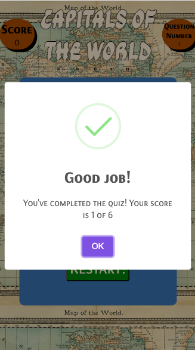

# Geotrivia!

Geotrivia is a site for everyone pasionate about quiz and Geography, we encourage to learn and break your record every time. The target is anyone who would like to spend spare time with a game that generates knowledge or students who would like to study in a more dinamic way.

In the site you could find questions relates to Countrys and theyr Capitals, there is a score counter and at the en your progress will be shown, you can play as many times you want.

## Features

### Instructions

- The display is very straight forward, the titel and the background resemble to and old parchment or map and the start button shows green when hovered inviting to start.

- A quick and consice introduction of how the game works

### Score and Question Number

- The points are shown twice during the Trivia, first there is a counter wich add 1 point for every right question and later the final score will be shown in a pop up window.

- To the right there is a Question Number counter who simply shows the amount of questions you had answered.

### Start Game

- After pressing "Start Game!" a country name is deployed and 4 options of capital citys are shown. There is only one chance to answer right, after every click the rest of the ocptions get automatically blocked.

### Correct and wrong answer

- The game is responsive to both, correct and wrong answers showing with respective green or red if the selection is right.

-If the answer is correct the score increases in 1, if wrong there is no penalty.

### Final Score

- After reaching the last question a pop up window is displayed congratulating the player and giving the final score.

- Also the "Next" button is replaced for a "Restart" givin the chance to play again as many times the user wants.

## Testing

- I tested this page in the main browsers (Chrome, Opera and Safari) and mobil devices, it shows good reaction to different screen sizes.

- All buttons are fully functional.

## Validation

### HTML

- I tested the html code in the validator and besides some syntax errors that were easly solved it passed all of them.

### CSS

 - I tested the CSS code in the validator and passed correctly after deleting some unused values.

 

 ### JavaScript

 - I tested the JS code in the validator and showed no error besides some missing semicolons.

## Solve problems

One of the main problems I had during the project was how to check the array of ojects for the right answer, comparing the option selected and the correct answer option storage in the variable, after many hours i could figure thru many tutorials, that first i should target the event of clicking the selected button and with this event create the function.

Other problem that was related was calling the funtion "checkAnswer" after the click of the selected option because after the first question, the array didn't advance as it clogged.

source: https://developer.mozilla.org/en-US/docs/Web/API/Node/cloneNode
https://www.javascripttutorial.net/javascript-dom/javascript-clonenode/

 ## Deployment
 
 The site was deployed to GitHub in the Deployment section, then in the Settings and the Pages section at the left.
 I selected the Main Branch, Root folder and save it, then automatically creates the deployer on top.

 link: https://fenasti.github.io/QuizGame/

## Credit

-I took information mainly from 2 tutorials in youtube:
https://www.youtube.com/watch?v=riDzcEQbX6k&t=645s
https://www.youtube.com/watch?v=PBcqGxrr9g8

-Also took inspiration from the quiz Project of a student from CodeInsitute, most about inspiration in what atributtes add to my project:
https://kera-cudmore.github.io/TheQuizArms/

-And in this blog on how to disable the buttons after selection:
https://www.qodo.co.uk/blog/javascript-enabling-and-disabling-form-field-elements/#:~:text=HTML%20form%20elements%20have%20an,property%20to%20true%20or%20false%20.

## Atributes for the future

I would like to add:
-A form with an option to introduce your name so at the end the score will be displayed personalized.
-A way to randomize the options order.
-More option games related to the same topic, like flags, questions, etc.

### Media

- https://sweetalert2.github.io/#download

- https://favicon.io/

